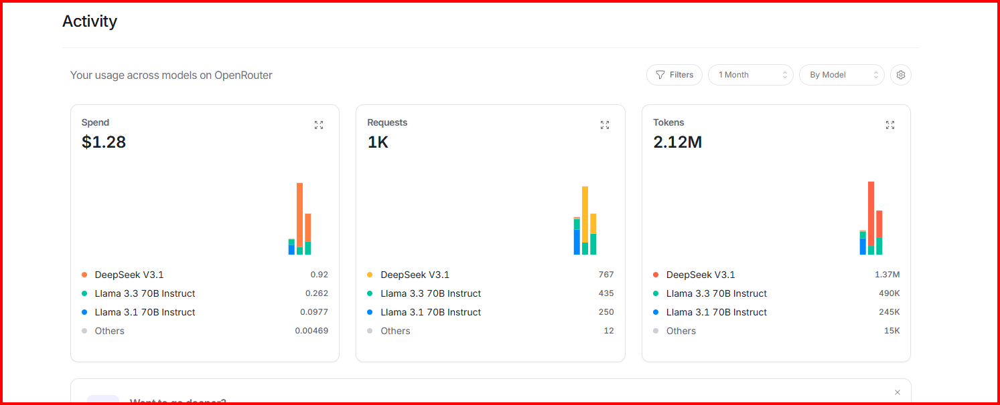

# Crasis

### *Train once. Run forever. Pay nothing.*
#### *A local tool layer for agents.*

[](https://pypi.org/project/crasis/) [](LICENSE)

```bash
pip install crasis            # inference only
pip install "crasis[mcp]"     # + MCP server (specialists as tools in Claude Desktop / Claude Code)
pip install "crasis[train]"   # + full build pipeline
```

Most agents route every classification through a frontier model. That means paying tokens, waiting 200ms–2s, and sending private data to a cloud server — for yes/no questions. A 4.3MB specialist answers the same question in under 3ms, locally, for free, forever.

```python
toolkit = CrasisToolkit.from_dir("./models")
response = client.messages.create(
    model="claude-haiku",
    tools=toolkit.anthropic_tools(),  # also openai_tools(), gemini_tools()
    messages=[...]
)
```

The frontier model calls local specialists for classification. No API tokens burned. No 200ms wait. No data leaves the machine.

```bash
crasis mcp  # specialists show up as native tools in Claude Desktop / Claude Code
```

---

## The Problem

Current AI agents are brilliant generalists doing the work of specialists. You are burning tokens — and surrendering privacy — to answer questions like:

- *"Is this WhatsApp message asking about my pricing?"*
- *"Does this email need a reply today?"*
- *"Is this customer angry?"*

A frontier model answering those questions is a nuclear weapon aimed at a mailbox. You're paying $20–50/month, waiting 200ms–2s per query, and sending your private data to a cloud server — for a yes/no answer a 4.3MB model could give you in under 3ms, locally, for free, forever.

**The token model is extractive by design.** Every query is a toll. The provider is incentivized for you to stay dependent. There is no learning curve benefit passed to you. Ever.

Crasis breaks that.

---

## The Solution

Crasis uses a frontier model **once** — to understand your problem and generate synthetic training data. That intelligence is then distilled into a tiny specialist model that lives on your device.

After that, the frontier model is never called again for that task.

```
You describe your problem in plain English
            ↓
Crasis calls a frontier model once → generates training data
            ↓
Crasis trains a tiny specialist (4–160MB) on your hardware
            ↓
Specialist deploys locally — runs forever, zero API cost
```

The frontier model is the architect. The specialist is the worker. You only need the architect once.

---

## Agent Integration

Specialists slot directly into any agent framework as local tools. The frontier model handles reasoning; specialists handle classification in under 3ms with no API calls.

### Drop-in tool for any framework

```python
from crasis import CrasisToolkit

toolkit = CrasisToolkit.from_dir("./models")

# Anthropic
response = client.messages.create(
    model="claude-haiku",
    tools=toolkit.anthropic_tools(),
    messages=[{"role": "user", "content": "Triage this: 'I want a refund NOW'"}]
)

# OpenAI / OpenAI-compatible
response = client.chat.completions.create(
    model="gpt-4o-mini",
    tools=toolkit.openai_tools(),
    messages=[...]
)

# Gemini
response = model.generate_content("...", tools=toolkit.gemini_tools())
```

### MCP server — zero-code integration

```bash
crasis mcp --models-dir ./models
```

Specialists appear as native tools in Claude Desktop and Claude Code. No Python glue required. See [docs/AGENTIC.md](docs/AGENTIC.md) for full MCP setup.

### Managed orchestration loop

```python
from crasis import CrasisOrchestrator

orch = CrasisOrchestrator(
    toolkit=toolkit,
    provider="anthropic",
    model="claude-haiku",
)
result = orch.run("Triage these messages and tell me which needs immediate attention")
```

See [docs/AGENTIC.md](docs/AGENTIC.md) for the full agent integration guide.

---

## The Numbers

| | Frontier API | Crasis Specialist |
|---|---|---|
| Model size | 4GB+ | 4–160MB |
| Cost per query | $0.001–0.01 | $0.00 |
| Latency | 200ms–2s | under 3ms on CPU |
| Works offline | No | Yes |
| Data leaves device | Yes | Never |
| Gets cheaper over time | No | Already free |
| Accuracy on narrow tasks - synthetic data | ~97% | ~95–99% |

The [SCORECARD](./SCORECARD.md) shows synthetic and real-world holdout results for every specialist — that is the defense of the accuracy claim above, not a footnote. The two-number format (synthetic + holdout) is the honest way to report accuracy.

Those are the per-query inference economics — zero cost after training. The number below is the one-time training cost to build all ten specialists from scratch:

- 15 model builds
- 10 specialists produced (iterating on initial prototypes)
- 2.12M tokens
- **$1.28 spent**



---

## Pre-Built Specialists

Ten specialists, ready to pull. These cover the tasks people are most commonly paying frontier models to handle. Download, deploy, never pay for them again.

```bash
crasis pull whatsapp-triage      # Pricing/availability inquiry detector
crasis pull email-urgency        # Reply-now vs read-later classifier
crasis pull sentiment-gate       # High-arousal anger detection
crasis pull meeting-parser       # Extract who/when/what from scheduling messages
crasis pull pricing-detector     # Is this message asking about cost?
crasis pull spam-filter          # Personalizable noise classifier
crasis pull support-router       # Multi-class ticket categorization
crasis pull social-classifier    # Is this mention worth responding to?
crasis pull invoice-intent       # Payment/billing message detection
crasis pull availability-handler # Scheduling request → calendar link trigger
```

Each specialist:
- Ships as an ONNX model — runs anywhere, no GPU required
- Is 4–160MB on disk (most are under 11MB)
- Classifies in under 3ms on a laptop CPU
- Was trained on 3,000–10,000 synthetic examples generated from distillable frontier models
- Comes with a spec, eval results, and example inference code

### Evaluating Accuracy

Pre-built specialists ship with hand-authored holdout fixtures — real-world-style examples that were not generated by the training pipeline. These give an honest accuracy number, separate from the synthetic training metrics.

```bash
# Run holdout eval on any specialist
crasis eval -s specialists/spam-filter/spec.yaml \
    -m ./models/spam-filter-onnx \
    --holdout tests/fixtures/spam-filter.jsonl
```

Output shows both numbers side by side:

```
  Accuracy (synthetic) : 0.9920   ← how well it learned the training data
  Accuracy (holdout)   : 0.7000   ← how well it works on real text
  Synthetic-real gap   : +0.2920  ← the honest gap
```

Full results for all 10 specialists are in [SCORECARD.md](SCORECARD.md). Some specialists have meaningful synthetic-real gaps — the gap table tells you which ones need `crasis mix` most.

---

## Build Your Own

Three steps. One coffee.

### 1. Write a Spec

Describe your problem in plain English. A spec is not code — it's a contract.

```yaml
# specs/refund-detector.yaml
crasis_spec: v1
name: refund-detector
description: "Detect when a customer message is explicitly requesting a refund"

task:
  type: binary_classification
  trigger: "Customer is asking for their money back"
  ignore: "Customer is complaining but not requesting a refund"

constraints:
  max_model_size_mb: 20
  max_inference_ms: 100
  connectivity: none

quality:
  min_accuracy: 0.95
  eval_on: [ambiguous_phrasing, angry_tone, multiple_languages]

training:
  strategy: synthetic
  volume: 5000
```

### 2. Generate Training Data

Crasis calls [OpenRouter](https://openrouter.ai) with `enforce_distillable_text: true` — routing only to models whose licenses explicitly permit their outputs to be used for training. No ToS violations. No banned keys. Clean provenance on every sample.

```bash
export OPENROUTER_API_KEY=sk-or-v1-...
crasis generate --spec specs/refund-detector.yaml --count 5000
```

Generates ~5,000 labeled examples. Takes ~45 minutes. Costs ~$15 in API credits.

### 3. Train the Specialist

Runs locally on your GPU. RTX 4060 completes a BERT-Tiny distillation in under 30 minutes.

```bash
crasis train --spec specs/refund-detector.yaml --data ./data/refund-detector/train.jsonl
```

Outputs a ~4.3MB ONNX model. Deploy it anywhere.

```bash
crasis export --spec specs/refund-detector.yaml --model ./models/refund-detector
```

### Or: One Command

The three steps above are the manual path — useful for debugging or custom pipelines. For most use cases, `crasis build` runs the full pipeline in sequence:

```bash
crasis build --spec specs/refund-detector.yaml
```

Generate → train → eval → export. One command, one deployable ONNX package.

---

### Improving a Specialist with Real Data

Once a specialist is deployed and you've collected real-world examples it got wrong (or right), feed them back in:

```bash
# Your real examples — one JSON object per line
# {"text": "Win a free iPhone!", "label": "positive"}
# {"text": "Your invoice is attached", "label": "negative"}

crasis mix \
  --spec specialists/spam-filter/spec.yaml \
  --real-data ./my-inbox.jsonl
```

`crasis mix` validates your labels, merges your examples with the original synthetic data (oversampled 3x by default so real data isn't drowned out), retrains, and exports a new timestamped ONNX package. The original model is never overwritten.

```bash
# Tune the oversampling weight
crasis mix --spec specialists/spam-filter/spec.yaml \
           --real-data ./my-inbox.jsonl \
           --real-weight 5

# Point at a specific synthetic dataset
crasis mix --spec specialists/spam-filter/spec.yaml \
           --real-data ./my-inbox.jsonl \
           --synthetic-data ./data/spam-filter/train.jsonl
```

Valid label names for each specialist are printed at the start of the run — no guessing required.

---

## Inference

```python
from crasis import Specialist

# Load once
model = Specialist.load("./models/refund-detector-onnx")

# Classify forever — no API calls, no latency, no cost
result = model.classify("I want my money back, this is ridiculous")
# → {"label": "positive", "confidence": 0.97, "latency_ms": 0.6}

result = model.classify("Your product is terrible but I'll keep it")
# → {"label": "negative", "confidence": 0.94, "latency_ms": 0.6}
```

---

## Architecture

```
trainonce.dev / Crasis Studio   ← Hosted UI, custom builder
        │
Crasis CLI (this repo)          ← FOSS, MIT, runs anywhere
        │
        ├── Spec Parser         ← Converts plain English to training contract
        ├── Data Factory        ← OpenRouter + enforce_distillable_text
        ├── Training Pipeline   ← BERT-Tiny / BERT-Mini / BERT-Small distillation
        ├── Eval Harness        ← Validates against spec quality gates
        ├── ONNX Exporter       ← Universal deployment target
        ├── MCP Server          ← Specialists as tools in any MCP client
        └── CrasisToolkit       ← Drop-in tool layer for agent frameworks
```

**The Specialist Swarm**

At scale, a single conductor (frontier model) routes tasks to a swarm of local specialists. The frontier model handles edge cases and novel inputs. Specialists handle the 95% routine case — instantly, locally, for free.

```
Conductor (frontier model — called rarely)
    │
    ├── WhatsApp message → whatsapp-triage specialist
    ├── Email arrives → email-urgency specialist
    ├── Support ticket → support-router specialist
    └── Novel input → conductor handles, logs for future specialist
```

The swarm grows as you encounter new patterns. Each new specialist makes the conductor cheaper to run. Costs decrease as capability increases. This is the opposite of how token costs scale today.

---

## Roadmap

**Now — FOSS Core**
- [x] Spec format v1
- [x] OpenRouter data factory with `enforce_distillable_text`
- [x] BERT-Tiny / BERT-Mini training pipeline
- [x] ONNX export and local inference
- [x] Ten pre-built specialists
- [x] MCP server (`crasis mcp`)
- [x] CrasisToolkit — drop-in tool layer for Anthropic, OpenAI, Gemini

**Soon — Crasis Studio**

Don't want to manage API keys, clean training data, or run your own GPU?

[Crasis Studio](https://trainonce.dev) handles the full pipeline. Describe your problem, receive a deployable specialist. Pay for the build once. Run it forever.

Pricing is based on training complexity — number of samples, task type, and compute time. Transparent, quoted upfront, no subscriptions for the build itself.

**Later — Enterprise**

On-premise Crasis deployment for regulated environments. HIPAA, GDPR, ITAR-adjacent workflows. Private specialist registries. Audit trails. SLAs. [Contact us.](mailto:crasis@novitasventures.com)

---

## Why This Is Legal

Crasis uses `enforce_distillable_text: true` on all OpenRouter calls. This flag routes exclusively to models whose authors have explicitly permitted their outputs to be used for training and distillation — Llama variants, Nemotron, DeepSeek, and others.

You are not distilling Claude or GPT-4. You are using openly-licensed models as teachers, exactly as their authors intended. Every training sample has clean provenance. The EU AI Act (August 2026) requires exactly this kind of auditability. Crasis provides it by design.

---

## Hardware Requirements

**To build specialists:**
- Any GPU with 6GB+ VRAM (RTX 4060 completes in ~30 minutes)
- Or: CPU-only training (~4 hours for small specialists)
- Or: [Crasis Studio](https://trainonce.dev) handles this for you

**To run specialists:**
- Any laptop, Raspberry Pi, mobile device, or edge compute target
- ONNX runtime — available everywhere
- No GPU required for inference
- Minimum RAM: ~50MB per specialist

---

## Contributing

The ten pre-built specialists are the beginning. If you train a specialist for a task not covered here, we want it in this repo.

**To contribute a specialist:**
1. Train against a spec with `min_accuracy: 0.93` or higher
2. Include the spec, eval results, and at least 100 held-out test examples
3. Open a PR — specialists that pass eval are merged and published to the Crasis specialist registry

Specialists that reduce frontier model calls in agent pipelines are especially valuable contributions — they make the whole ecosystem cheaper to run.

The goal: 100 community specialists by end of 2026. Every one of them a task nobody needs to pay tokens for anymore.

---

## The Bigger Picture

The frontier model era solved the hardest problem in AI: general reasoning at scale. That problem is solved. The next problem is different — how do you take that general capability and make it fast, cheap, private, and permanent for the 95% of tasks that don't require general reasoning?

That's what Crasis is for.

Frontier models are brilliant generalists. Specialists are trained workers. You wouldn't hire a Harvard MBA to answer your phone every time it rings. You'd train a receptionist once and let them handle it forever.

**Stop renting intelligence. Own it.**

---

## License

MIT. Build cool things. Own your intelligence. Stop paying for tokens you don't need.

---

*Crasis is built by [Novitas Ventures LLC](https://novitasventures.com). The hosted pipeline and Studio are available at [trainonce.dev](https://trainonce.dev).*

*Named after the linguistic process of crasis — the contraction of two elements into one. That's what we do to intelligence: compress the full capability of a frontier model into a single-purpose specialist.*
